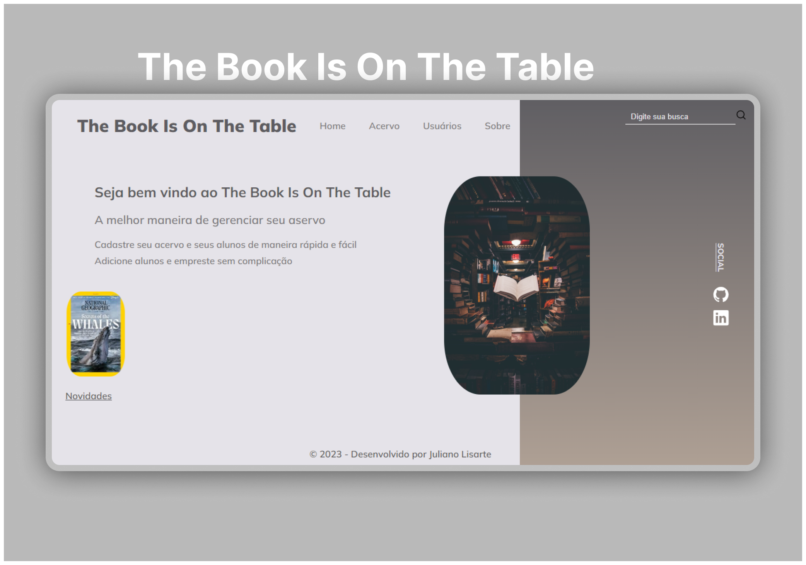

  

<h1 align="center">Projeto - The Book Is On The Table</h1>
<h2 align="center">Sistema de Gerenciamento de Biblioteca</h2>

 

  
  <a href="https://jlisarte.github.io/projeto_TheBookIsOnTheTable/" target="_blank">https://jlisarte.github.io/projeto_TheBookIsOnTheTable/</a>

## 🚀 Tecnologias

Esse projeto foi desenvolvido com as seguintes tecnologias:

- HTML e CSS
- Git e Github

## 💻 Projeto

O Sistema de Gerenciamento de Biblioteca é uma aplicação projetada para simplificar e aprimorar a gestão de bibliotecas, oferecendo um ambiente eficiente e organizado para o empréstimo, registro e controle de livros, revistas e cadastro de usuários.

---

Feito por Shadowkhan - Juliano Lisarte
